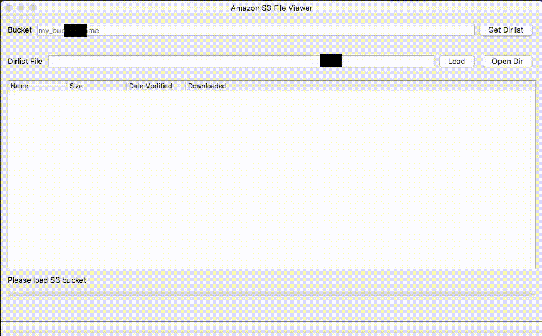

# S3Viewer [](https://travis-ci.com/SharonBrizinov/s3viewer)
## Publicly Open Amazon AWS S3 Bucket Viewer


`s3viewer` is a free tool for security researchers that lists the content of a publicly open s3 bucket and helps to identify leaking data. The tool allows you to view all the files on a given aws s3 bucket and download selected files and directories. The goal is to identify the owner of the bucket as quickly as possible in order to report that data is leaking from it.

The tool uses the Amazon S3 CLI to list directory contents and display them in a tree view GUI from which you can navigate to view all directories and files and even download them. You can also use the `Load` button to load a pre-downloaded dirlist to view the directory hierarchy offline.


 
## Feature List
- Generate AWS S3 Bucket dirlist
- View and interact with S3 Bucket directory hierarchy
- Offline mode: load a pre-generated dirlist to work offline
- Search for specific files easily
- Supporting multiple open storage instances including FTP (anonymous access), HTTP Index (Apache/nginx-style directory listing), AWS S3 Bucket
- Cross-platform (Windows, MAC, Linux) GUI desktop application
- Free

## Setup
**Prerequisites**

- python3 + PyQt5
- [aws cli](https://aws.amazon.com/cli/)

Simply run `python3 -m pip install -r packaging/requirements.txt`


**Configurations**

Please run `aws configure` once and set the region name to one of the available AWS regions, for eaxmple `us-east-1`. If you want to view your own S3 bucket fill the rest of the details correctly, otherwise simply fill with some arbitrary data such as `abc`.

## Run
```bash
python s3viewer.py
```
**Usage**
Fill the name of the bucket and press `Get Dirlist`. Use double-click to download a file or use right-click for more options such as download all files in a directory. You can keep the generated dirlist to load quickly later.

## Motivation
### TL;DR
Publicly open s3 buckets have become a serious threat to many companies and people due to [massive data leaks](https://github.com/nagwww/s3-leaks) which led to countless breaches, extortions, and overall embarrassment to all invloved parties. I have personally discovered and reported on dozens of major s3 buckets open to the public belonging to companies that were completely unaware of them. This must be stopped and I hope this tool will help security researchers to identify misconfigured s3 buckets in order to responsibly disclose it to the affected companies.

### Longer Version
Simple Storage Service (S3) bucket is a public cloud storage resource available in Amazon Web Services (AWS). They are favorable by developers and IT team, as their storages offer a simple web service interface which enables them to store and retrieve any amount of data at any time from anywhere. Companies are trying to keep up with the pace and ensure their cloud-stored data is safe, yet despite that, they haven't fully incorporated best practices from AWS and we see **[WAAAAAAAY TOO MANY](https://buckets.grayhatwarfare.com/) misconfigured publicly open buckets that can be easily accessed by anyone**.

As the popularity of s3 buckets increased I started to discover more and more publicly open buckets and needed a tool to assist me in identifying the companies behind the buckets. Sometimes correlating a bucket name to a company may prove to be an easy task, but sometimes the name of the bucket is too vague and it’s unclear of the company behind it, for example “devbucket” or “prod3bucket”.

The problem with cloud storage technologies, such as S3 buckets, is that they tend to be misconfigured, as proven in recent data breaches, and may leak data to anyone with a browser. That is why it is important to recognize and report any leaked information, since today's leaked information can be a random company's information, but  tomorrow's leaked information could be your business or personally identifying information leaked to criminals.
